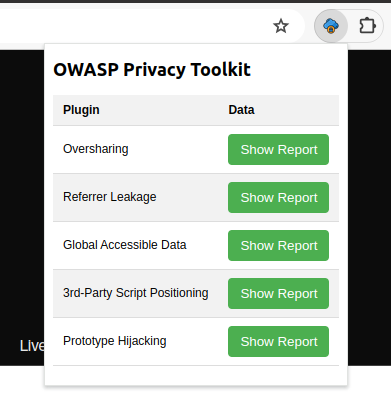
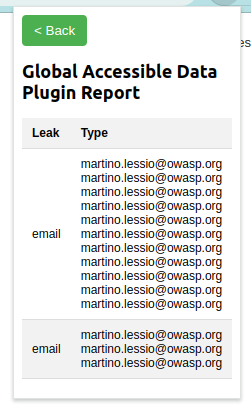
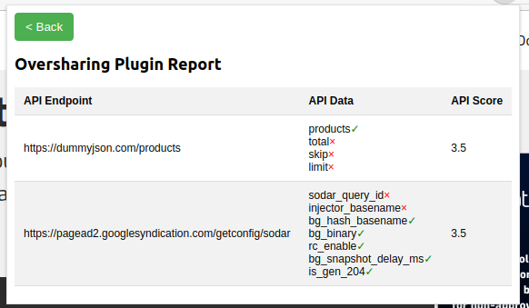
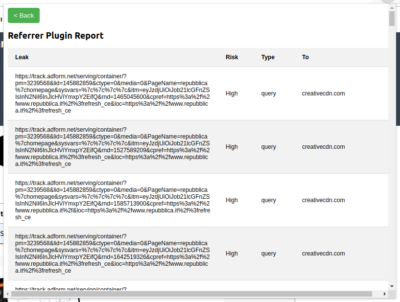

# OWASP Privacy Toolkit

   

The OWASP Privacy toolkit represents a new tool in the realm of online security and privacy. Designed as a browser extension, it targets to a diverse audience comprising end-users and auditors alike. Its primary objective is to bring awareness regarding privacy concerns while also providing comprehensive reports on pertinent browsing activities.

The toolkit goal is to provide the detection of both privacy threats and security issues with an impact on privacy on the browser layer. The project focuses on the importance of final users' and developers' education in the realm of digital privacy protection. 

At its core, the OWASP Privacy Toolkit leverages a set of detection techniques specifically crafted to identify a broad spectrum of privacy issues, such as:
- Referrer Leakage
- Data Oversharing
- Globally Accessible Data
- Script Positioning Best Practices
- Prototype Protection Best Practices

## Installation

Just load the `browser-extension` folder as unpacked extension in Chromium based browsers.

Tested on Google Chrome 128.

## Plugins

### Globally Accessible Data

The Globally Accessible Data plugin is designed to identify potential privacy issues in the context of modern web applications 
where sensitive data is stored in globally accessible locations within the Document Object Model (DOM) or the global JavaScript object. 

Such practices can expose sensitive information to all JavaScript code running on the page, including third-party scripts, thus increasing the risk in case a data breach occurs or if the web application makes use of malicious untrusted JavaScript code. 

This plugin employs DOM navigation techniques and implements a set of regular expressions to detect and report sensitive data 
stored in globally accessible memory.
The included set of regular expressions identifies sensitive information, such as email addresses, 
credit card numbers, phone numbers, etc.

### Data Oversharing

The Data Oversharing plugin is designed to enhance the security and efficiency of client-server 
communication by identifying instances of data oversharing in Client-Server communication APIs.
The plugin currently focuses on JSON REST APIs.

Since Data Oversharing occurs when a server-side application transmits more data fields than necessary to the client, potentially exposing sensitive information and increasing the attack surface the plugin uses hooking techniques on the client-side JSON deserialization APIs adding data tainting methodologies, by using the JavaScript Proxy paradigm to detect whether a field of the received objective is actually used or not.

By identifying unnecessary data transmission, the plugin helps to provide useful information to minimize the exposure of sensitive 
information, thereby enhancing the overall security and privacy of the client-server communication.

### Referrer Leakage

The Referrer Leakage plugin is designed to identify instances where sensitive data is inadvertently exposed through the HTTP Referrer header. 
This type of data leakage can occur when a web page containing sensitive information is accessed and, subsequently, a request is made to a third-party web application, which may include the original URL as part of the Referrer header. 

This plugin inspects all outgoing network traffic to the third-party web application, analyzes the Referrer headers, if any, and assesses the risk associated with the disclosed information.

### Third-Party Script Positioning

The Third-party Script Positioning plugin is designed to analyze the behaviour of web applications and ensure that 
third-party JavaScript scripts are loaded after first-party scripts. 

This best practice prevents third-party scripts from potentially modifying DOM-level functions or accessing sensitive data before the first-party scripts have been executed and have stored a safe reference to the DOM-level function prototypes. 

The plugin inspects all scripts loaded by the web application, determines their origin, tracks their load order at runtime, and reports 
any instances where third-party scripts are loaded before first-party scripts.
It uses URL analysis to determine whether each script is a first-party (originating from the same domain as the web application) or a third-party script (originating from an external domain), including all the types of scripts, including inline scripts, async resources, etc.

## Project Structure

### Browser Extension

The `browser-extension` folder contains the source code of the browser extension being implemented.

Each plugin has its own script and can run in a different behavior, as specified in the manifest.json file.

### Tests

In the `test` folder are present the PoCs of the techniques that are covered by the browser extension.

- Globally accessible data
- Oversharing
- Referrer Leakage
- Third-Party Script Positioning

In each folder, a README.md file describes how the test can be executed and tested against the browser extension.

## Contributions

You can contribute to this repository through bug-reports, bug-fixes, new code or new documentation. For any report, please raise an issue in the repository before submitting a PR. 

We welcome suggestions and feedback from the community.

### Credits

[Privacy icons created by itim2101 - Flaticon](https://www.flaticon.com/free-icons/privacy)

## Acknowledgements

This project received funding from the European Union's Horizon 2020 research and innovation programme under grant agreement No. 101019206.

[https://testable.eu/](https://testable.eu/)

   
  Funded by the European Union

## License
 
MIT License

Copyright (c) 2024 IMQ Minded Security

Permission is hereby granted, free of charge, to any person obtaining a copy
of this software and associated documentation files (the "Software"), to deal
in the Software without restriction, including without limitation the rights
to use, copy, modify, merge, publish, distribute, sublicense, and/or sell
copies of the Software, and to permit persons to whom the Software is
furnished to do so, subject to the following conditions:

The above copyright notice and this permission notice shall be included in all
copies or substantial portions of the Software.

THE SOFTWARE IS PROVIDED "AS IS", WITHOUT WARRANTY OF ANY KIND, EXPRESS OR
IMPLIED, INCLUDING BUT NOT LIMITED TO THE WARRANTIES OF MERCHANTABILITY,
FITNESS FOR A PARTICULAR PURPOSE AND NONINFRINGEMENT. IN NO EVENT SHALL THE
AUTHORS OR COPYRIGHT HOLDERS BE LIABLE FOR ANY CLAIM, DAMAGES OR OTHER
LIABILITY, WHETHER IN AN ACTION OF CONTRACT, TORT OR OTHERWISE, ARISING FROM,
OUT OF OR IN CONNECTION WITH THE SOFTWARE OR THE USE OR OTHER DEALINGS IN THE
SOFTWARE.
